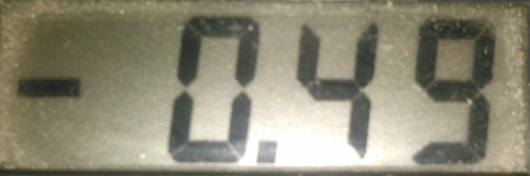
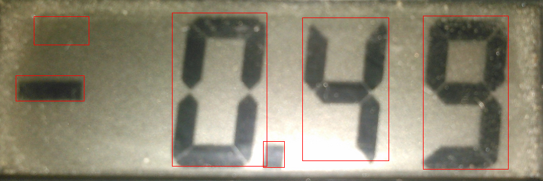

# ImageZ

ImageZ - это библиотека для анализа и обработки изображений с оберткой для Java. Библиотека реализует технологию параллелизированных вычислений(OpenMP), а также вычислений на GPU(С++ AMP).

## Особенности(на текущий момент)
- Бинаризация
- Фильтрация
- Нахождение образов/контуров
- Масштабирование изображения
- Возможность использовать различные математические морфологии
- Своя форма представления изображения, представляющая собой одномерную и двумерную матрицы
- Удобный конвертер для конвертирования изображения в матрицу

## Результат использования
### Исходное изображение:

### Бинаризация(с медианным фильтром 5х5 и наращиванием 5х15):

### Нахождение образов(в данном примере с использованием отсева по ширине и площади):


## Использование
Нужно импортировать ```.jar``` и подключить native-библиотеку:
```java
System.loadLibrary(ImageZ.LIBRARY_NAME);
```
Не забываем указывать местонахождение сторонних библиотек:
```java
-Djava.library.path=/*Здесь путь*/
```
Пример бинаризации с помощью ImageZ:
```java
// загружаем изображение в оттенках серого
BufferedImage fileImage = ImageIO.read(new FileInputStream("src/test/test.png"));
BufferedImage bImage = new BufferedImage(fileImage.getWidth(),
                                          fileImage.getHeight(),
                                          BufferedImage.TYPE_BYTE_GRAY);
Graphics g = bImage.getGraphics();
g.drawImage(fileImage, 0, 0, null);

// преобразуем картинку в IZMatrix
IZMatrix imageSrc = IZConverter.convertBImageToIZMatrix(bImage);

// создаем экземпляр IZMatrix, где будет преобразованное изображение
IZMatrix imageDest = new IZMatrix(new IZSize(imageSrc.getWidth(), imageSrc.getHeight()));

// вызываем метод binarize для бинаризации изображения
IZProc.binarize(imageSrc, imageDest, IZBinarizationModes.IZ_BRADLEY_ROT, 10, 0.05, 0, 0);

// преобразуем обработанное изображение назад в BufferedImage
BufferedImage bImageBinarized = IZConverter.convertIZMatrixToBImage(imageDest);

// сохраняем 
ImageIO.write(bImageBinarized, "PNG", new FileOutputStream(new File("src/test/test1.png")));
```
